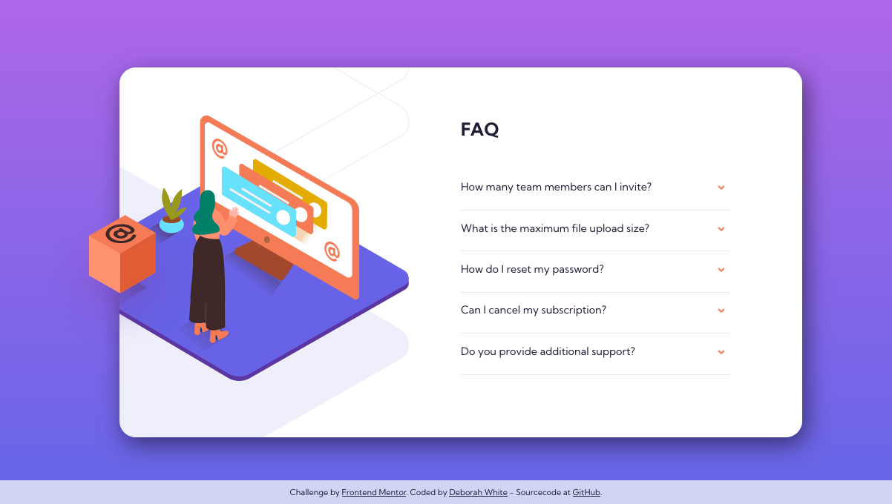

# Frontend Mentor - FAQ accordion card solution

This is a solution to the [FAQ accordion card challenge on Frontend Mentor](https://www.frontendmentor.io/challenges/faq-accordion-card-XlyjD0Oam). Frontend Mentor challenges help you improve your coding skills by building realistic projects. 

## Table of contents

- [Overview](#overview)
  - [The challenge](#the-challenge)
  - [Screenshot](#screenshot)
  - [Links](#links)
- [My process](#my-process)
  - [Built with](#built-with)
  - [What I learned](#what-i-learned)
  - [Continued development](#continued-development)
  - [Useful resources](#useful-resources)
- [Author](#author)

## Overview

### The challenge

Users should be able to:

- View the optimal layout for the site depending on their device's screen size

### Screenshot

### Links

- Solution URL: [Source code on GitHub](https://github.com/gelbehexe/frontend-mentor-faq-accordion-card)
- Live Site URL: [My live page on a server](https://frontend-mentor-faq-accordion-card-gelbehexe.netlify.app/)

## My process

### Built with

- Semantic HTML5 markup
- CSS
  - custom properties
  - Flexbox
  - Grid
- Mobile-first workflow
- [Sass](https://sass-lang.com/) - Sass stylesheet language
- [JavaScript](https://developer.mozilla.org/en-US/docs/Web/JavaScript/Reference) - JavasScript language
- [webpack](https://webpack.js.org/) - Static module bundler 
- [HtmlWebpackPlugin](https://github.com/jantimon/html-webpack-plugin/blob/main/README.md) - HTML file creator (webpack plugin)
- [postcss](https://postcss.org/) - CSS transformer with JavScript
- [eslint](https://eslint.org/) - Static code analyzer
- [stylelint](https://stylelint.io/) - Static code analyzer for css/scss
- [prettier](https://prettier.io/) - An opinionated code formatter
- [babel](https://babeljs.io/) - JavaScript compiler

### What I learned

I learned to use CSS grid templates with named areas and responsive area, extended code generation.
To see how you can add code snippets, see below:

### Continued development

It was not easy to position the logo. At least it was more complicated than creating the accordion. I've done it without using JavaScript except for the import of the Stylesheet.

### Useful resources

- [CSS-Tricks](https://css-tricks.com/) - Tips, Tricks, and Techniques on using Cascading Style Sheets.

## Author

- Frontend Mentor - [@gelbehexe](https://www.frontendmentor.io/profile/gelbehexe)
